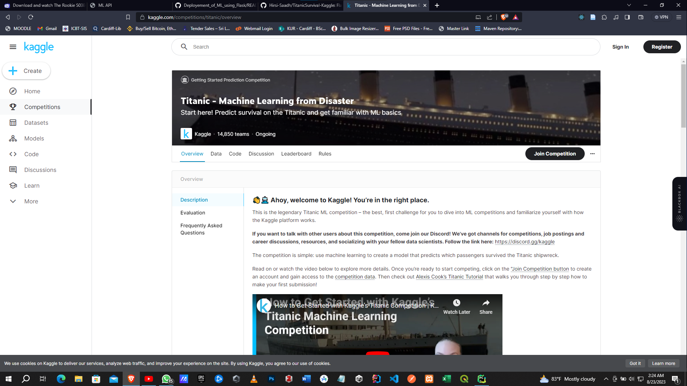
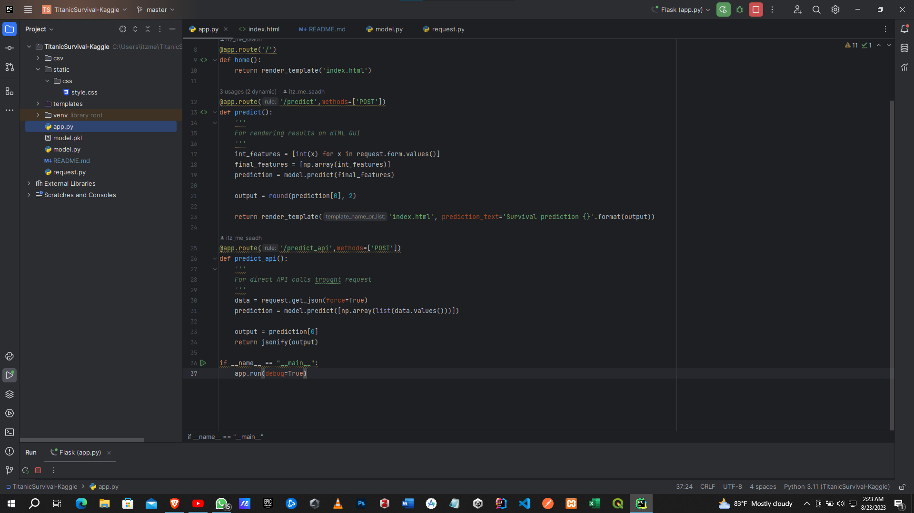
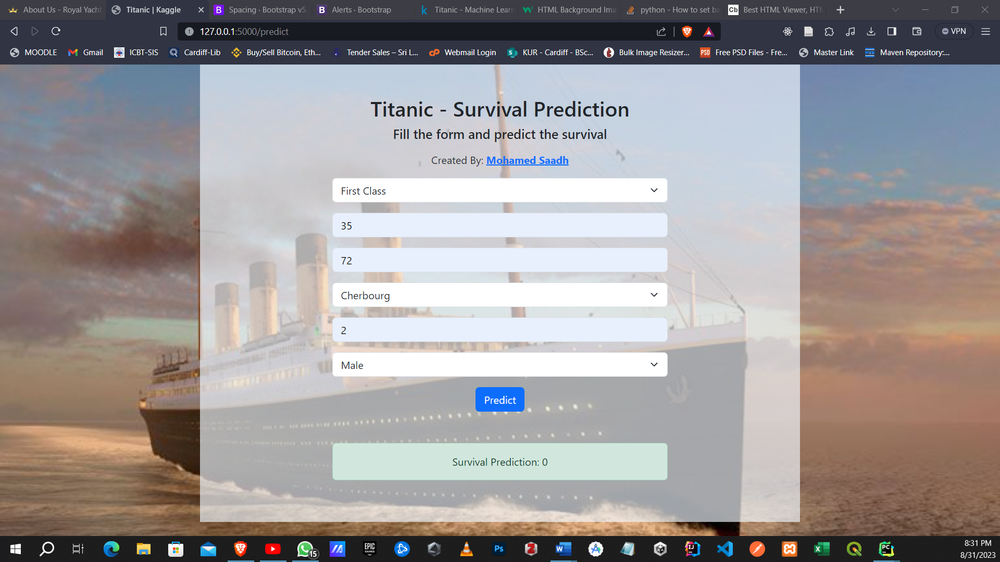
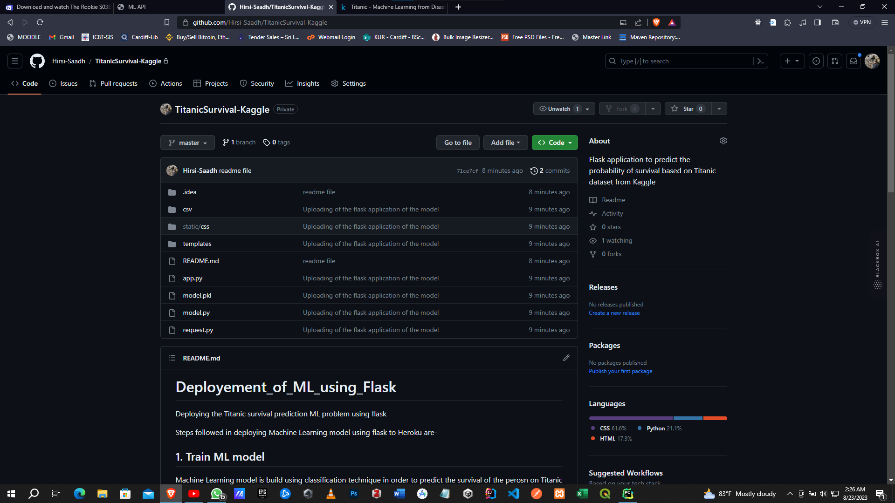

# Deployment of Titanic Survival Model via Flask
Deploying the Titanic survival prediction ML problem using flask

Steps followed in deploying Machine Learning model using flask 

## Train and Test Machine Learning Model
Machine Learning model is build using classification technique in order to predict the survival of the person on Titanic using the dataset available on Kaggle.

Link to the Kaggle Dataset: https://www.kaggle.com/competitions/titanic

## 2. Create a web application using Flask (I've used PyCharm)
I have defined the app routes and completing the app.py file, and created a Index.html which will serve as the home page, which contains all the field required to run the model.

## 3. Completed Titanic Survival Predictor
I have used bootstrap to design the form. The application submits the form to predict API and uses the created model to predict the survival

## 4. Commit the code to GitHub
 Now create some of the required files for deployment and then commit all the files to GitHub.

